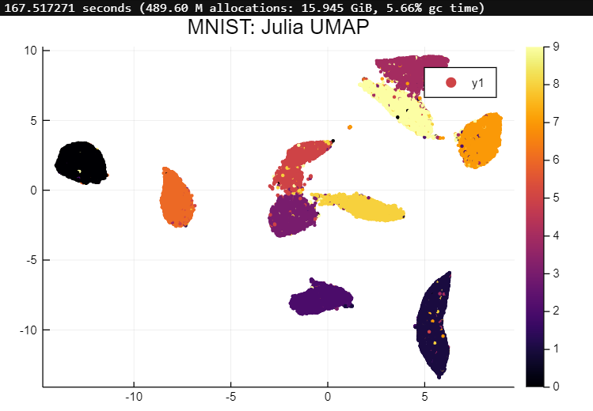

# UMAP.jl (WIP)
[](https://travis-ci.com/dillondaudert/UMAP.jl)[](https://ci.appveyor.com/project/dillondaudert/umap-jl)
[](https://coveralls.io/github/dillondaudert/UMAP.jl?branch=master) [](https://codecov.io/gh/dillondaudert/UMAP.jl)

An implementation of the [Uniform Manifold Approximation and Projection](https://arxiv.org/abs/1802.03426) dimension reduction
algorithm in Julia.

> McInnes, L, Healy, J, Melville, J, *UMAP: Uniform Manifold Approximation and Projection for
> Dimension Reduction*. ArXiV 1802.03426, 2018

## Usage
```jl
embedding = umap(X, n_components; n_neighbors, metric, min_dist, ...)
```
The `umap` function takes two arguments, `X` (a matrix of shape (n_features, n_samples)), `n_components` (the number of dimensions in the output embedding), and various keyword arguments. Several important ones are:
- `n_neighbors::Int=15`: This controls how many neighbors around each point are considered to be part of its local neighborhood. Larger values will result in embeddings that capture more global structure, while smaller values will preserve more local structures.
- `metric::SemiMetric=Euclidean()`: The (semi)metric to use when calculating distances between points. This can be any subtype of the `SemiMetric` type from the `Distances.jl` package, including user-defined types.
- `min_dist::Float=0.1`: This controls the minimum spacing of points in the embedding. Larger values will cause points to be more evenly distributed, while smaller values will preserve more local structure.

The returned `embedding` will be a matrix of shape (n_components, n_samples).

## Implementation Details
There are two main steps involved in UMAP: building a weighted graph with edges connecting points to their nearest neighbors, and optimizing the low-dimensional embedding of that graph. The first step is accomplished either by an exact kNN search (for datasets with `< 4096` points) or by the approximate kNN search algorithm, [NNDescent](https://github.com/dillondaudert/NearestNeighborDescent.jl). This step is also usually the most costly.

The low-dimensional embedding is initialized (by default) with the eigenvectors of the normalized Laplacian of the kNN graph. These are found using ARPACK (via [Arpack.jl](https://github.com/JuliaLinearAlgebra/Arpack.jl).

## Current Limitations
- **No transform**: Only one-time embeddings are possible at the moment. That is to say, it isn't possible to "fit" UMAP to a dataset and then use it to "transform" new data
- **Input data types**: Only data points that are represented by vectors of numbers (passed in as a matrix) are valid inputs. This is mostly due to a lack of support for other formats in [NNDescent](https://github.com/dillondaudert/NearestNeighborDescent.jl). Support for e.g. string datasets is possible in the future
- **Sequential**: This implementation does not take advantage of any parallelism

## External Resources
- For a great description of how UMAP works, see [this page](https://umap-learn.readthedocs.io/en/latest/how_umap_works.html) from the Python UMAP documentation
- If you're familiar with [t-SNE](https://lvdmaaten.github.io/tsne/), then [this page](https://jlmelville.github.io/uwot/umap-for-tsne.html) describes UMAP with similar vocabulary to that dimension reduction algorithm

## Examples
The full MNIST and FMNIST datasets are plotted below using both this implementation and the [Python implementation](github.com/lmcinnes/umap) for comparison. These were generated by [this notebook](PlotMNIST.ipynb).

Note that the memory allocation for the Python UMAP is unreliable, as Julia's benchmarking doesn't count memory allocated within Python itself.
### MNIST



### FMNIST


## Disclaimer
This implementation is a work-in-progress. If you encounter any issues, please create
an issue or make a pull request.
